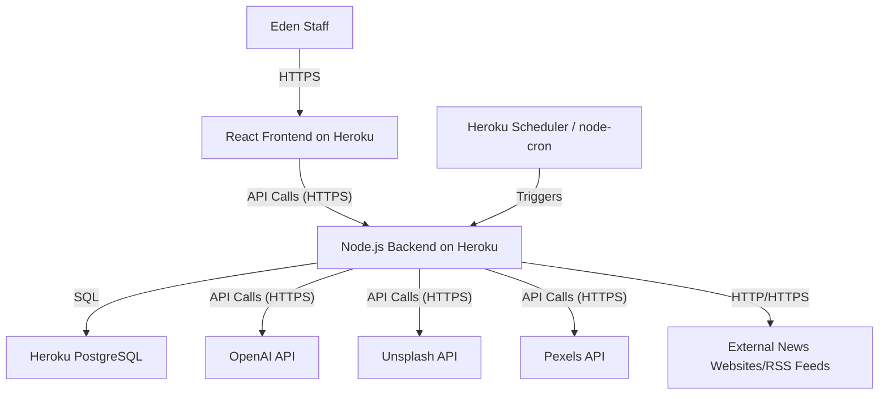

Okay, this is a fantastic foundation. The request is to create a specification and implementation plan for an AI (let's call it "DevAI") to build an application that orchestrates other AIs for Eden's content creation. The application itself will be a Node.js backend, a React frontend, and deployed on Heroku.

Here's the comprehensive specification and implementation plan:

**Project Title:** Eden Content AI Orchestrator (ECAO)

**1. Introduction & Overview**

The Eden Content AI Orchestrator (ECAO) will be a web application designed to streamline and enhance content creation for Eden.co.uk. It will leverage various third-party AI services for tasks such as news aggregation, content analysis, text generation, video script creation, and image sourcing. The ECAO will provide a user-friendly interface for Eden staff to manage these processes, review AI-generated outputs, and ultimately produce high-quality, brand-aligned content more efficiently.

The system will consist of:
*   A **React frontend** for user interaction and management.
*   A **Node.js backend** to handle business logic, API integrations, and task scheduling.
*   A **PostgreSQL database** (via Heroku Add-on) for storing configurations, fetched data, and generated content.
*   Integration with external AI APIs (OpenAI, Unsplash, Pexels, etc.).

**2. Goals & Objectives**

*   **Automate News Collation:** Fetch and summarize relevant Christian news from specified sources.
*   **Facilitate Content Gap Analysis:** Help identify opportunities by comparing trending news with Eden's existing content themes and product catalog.
*   **Streamline Content Generation:** Provide tools to generate drafts for blog posts, PR articles, and video scripts using AI, based on selected news or themes.
*   **Simplify Media Sourcing:** Suggest relevant royalty-free images for content.
*   **Maintain Brand Consistency:** Allow configuration of prompts and style guides to ensure AI outputs align with Eden's voice.
*   **Improve Efficiency:** Reduce manual effort in content research and initial drafting.
*   **Human-in-the-Loop:** Ensure all AI-generated content is reviewable and editable by Eden staff before use.

**3. Target Users**

*   Eden.co.uk Content Team
*   Eden.co.uk Marketing Team
*   Eden.co.uk PR Team

**4. Functional Requirements**

**4.1. User Management & Authentication**
    *   FR1.1: Secure login for authorized Eden staff.
    *   FR1.2: (Future) Role-based access control (Admin, Editor, Viewer).

**4.2. News Source Management**
    *   FR2.1: Admin users can add, view, edit, and delete news source URLs (websites, RSS feeds).
    *   FR2.2: Specify scraper type for each source (RSS, generic web scrape).
    *   FR2.3: Tag sources with relevant categories (e.g., "Bible Literacy," "Church Trends").

**4.3. Automated News Ingestion & Processing**
    *   FR3.1: System shall periodically (configurable schedule, e.g., daily) fetch content from configured news sources.
        *   FR3.1.1: For RSS feeds, parse using `feedparser`.
        *   FR3.1.2: For websites, use a robust scraping library (e.g., `Puppeteer` or `Cheerio` with careful selector configuration) to extract article titles, URLs, and main content.
    *   FR3.2: System shall use an LLM API (e.g., OpenAI) to:
        *   FR3.2.1: Summarize fetched articles based on a configurable prompt (similar to "News Collation & Analysis" prompt provided).
        *   FR3.2.2: Estimate share/discussion potential (this is hard; initially, may rely on LLM's "guess" or look for explicit share counts if scrapable).
        *   FR3.2.3: Identify key themes/topics within each article.
    *   FR3.3: Store fetched articles, summaries, and metadata in the database.
    *   FR3.4: Provide a dashboard view of recently fetched and summarized news, filterable by source, date, and identified themes.

**4.4. Content Comparison & Opportunity Identification**
    *   FR4.1: Users can select a summarized news story.
    *   FR4.2: System shall allow users to manually input or link to recent Eden content (blog posts, newsletter themes, social media topics) for comparison. (Full automated comparison is complex for MVP).
    *   FR4.3: System shall use an LLM API to analyze the selected news story against user-provided Eden content themes/keywords and a list of Eden product categories/keywords.
    *   FR4.4: The analysis should identify (as per prompt):
        *   Overlap (topics already covered).
        *   Gaps (new angles or topics).
        *   Opportunities for unique Eden perspective.
        *   Potential connections to Eden products.
    *   FR4.5: Display comparison results to the user.

**4.5. AI-Powered Content Generation**
    *   FR5.1: **Blog/PR Article Generation:**
        *   FR5.1.1: User selects a news story (or enters a custom topic).
        *   FR5.1.2: User can select a pre-defined prompt template (e.g., "Blog Post," "PR Article") or customize the prompt. Prompts should be stored and manageable.
        *   FR5.1.3: System sends the selected news story/topic and the refined prompt (incorporating Eden's tone, product link instructions, etc.) to an LLM API.
        *   FR5.1.4: Display the generated text in an editable text area.
        *   FR5.1.5: Allow users to save, edit, and mark the generated content as "Approved" or "Rejected."
    *   FR5.2: **Video Script Generation:**
        *   FR5.2.1: User selects a generated blog post (or enters text).
        *   FR5.2.2: User selects a video script prompt template (e.g., "60-second Instagram Script").
        *   FR5.2.3: System sends the content and prompt to an LLM API.
        *   FR5.2.4: Display the generated script, including visual suggestions, in an editable format.
        *   FR5.2.5: Allow users to save, edit, and manage scripts.

**4.6. Image Sourcing**
    *   FR6.1: User selects a generated article/blog post (or enters keywords/topic).
    *   FR6.2: System uses a configurable prompt (as per "Image Sourcing" prompt) and queries Unsplash and Pexels APIs.
    *   FR6.3: Display suggested images with links to their source URLs.
    *   FR6.4: Allow users to mark images as "Suitable" or "Unsuitable" for tracking preferences.

**4.7. Product Catalog Integration (Simplified)**
    *   FR7.1: Admin users can manage a simple list of Eden product categories and representative keywords (e.g., "Study Bibles," "Devotionals on Prayer").
    *   FR7.2: This list will be used by LLM prompts to suggest relevant product tie-ins.

**4.8. Prompt Management**
    *   FR8.1: Admin users can create, view, edit, and delete prompt templates for each generation task (Summarization, Blog, Video Script, Image Sourcing).
    *   FR8.2: Prompts should support placeholders (e.g., `{{NEWS_URL}}`, `{{ARTICLE_SUMMARY}}`, `{{PRODUCT_CATEGORIES}}`) that the system will populate before sending to the LLM.

**4.9. Configuration & Settings**
    *   FR9.1: Store API keys for external services (OpenAI, Unsplash, Pexels) securely.
    *   FR9.2: Configure news fetching schedule.
    *   FR9.3: Configure Eden's tone of voice guidelines (as text for reference or to be included in prompts).
    *   FR9.4: List excluded topics for news filtering.

**5. Non-Functional Requirements**

*   **NFR1: Performance:**
    *   Frontend UI should be responsive.
    *   Backend API responses for user-facing actions should ideally be within 2-3 seconds. Long-running AI generation tasks can be asynchronous, with UI updates on completion.
*   **NFR2: Scalability:**
    *   The system should handle a moderate number of news sources (e.g., 20-50) and daily processing. Heroku dynos can be scaled as needed.
*   **NFR3: Usability:**
    *   Intuitive and clean user interface.
    *   Clear feedback on AI task progress and completion.
    *   Easy editing of generated content.
*   **NFR4: Security:**
    *   Secure storage of API keys and user credentials.
    *   Protection against common web vulnerabilities (XSS, CSRF).
    *   All external API communication over HTTPS.
*   **NFR5: Maintainability:**
    *   Well-structured, commented code.
    *   Modular design for backend services and frontend components.
    *   Use of environment variables for configuration.
*   **NFR6: Reliability:**
    *   Robust error handling for API calls and web scraping.
    *   Logging of significant events and errors.

**6. Technical Stack**

*   **Frontend:** React (with Create React App or Vite), Redux/Zustand (for state management), Axios (for API calls), Tailwind CSS or Material-UI (for styling).
*   **Backend:** Node.js with Express.js.
*   **Database:** PostgreSQL (Heroku Postgres).
*   **Scheduling:** `node-cron` or a Heroku Scheduler job.
*   **Web Scraping:** `Puppeteer` (for complex JS-rendered sites) or `axios` + `cheerio` (for static sites), `feedparser` (for RSS).
*   **External APIs:**
    *   OpenAI API (or similar like Claude, Gemini) for text generation, summarization, analysis.
    *   Unsplash API for images.
    *   Pexels API for images.
*   **Deployment:** Heroku.
*   **Version Control:** Git (e.g., GitHub, GitLab).

**7. System Architecture (High-Level)**

**8. Data Model (Key Entities - PostgreSQL)**

*   **Users:** `id`, `email`, `password_hash`, `role`, `created_at`, `updated_at`
*   **NewsSources:** `id`, `name`, `url`, `type` (RSS, WEBSITE), `category_tags`, `last_fetched_at`, `is_active`, `created_at`, `updated_at`
*   **FetchedArticles:** `id`, `news_source_id` (FK), `original_url`, `title`, `raw_content_snippet`, `summary_text`, `llm_identified_themes`, `llm_estimated_shares`, `fetched_at`, `processed_at`, `status` (PENDING, PROCESSED, ERROR)
*   **GeneratedContent:** `id`, `user_id` (FK), `type` (BLOG, PR, VIDEO_SCRIPT), `source_article_id` (FK, optional), `input_topic_text` (optional), `generated_text`, `status` (DRAFT, REVIEW, APPROVED, REJECTED), `created_at`, `updated_at`
*   **ProductKeywords:** `id`, `category_name`, `keywords` (text array or comma-separated), `created_at`, `updated_at`
*   **PromptTemplates:** `id`, `name`, `type` (SUMMARIZE, BLOG, VIDEO_SCRIPT, IMAGE), `template_text`, `created_at`, `updated_at`
*   **ApiKeys:** `id`, `service_name` (OPENAI, UNSPLASH, PEXELS), `api_key_encrypted`, `created_at`, `updated_at` (Handled via Heroku config vars is better for security)

**9. API Design (Illustrative Examples - Node.js/Express)**

*   `POST /api/auth/login`
*   `GET /api/news-sources`
*   `POST /api/news-sources`
*   `PUT /api/news-sources/:id`
*   `DELETE /api/news-sources/:id`
*   `GET /api/fetched-articles` (with filters)
*   `POST /api/fetched-articles/:id/process` (triggers summarization, etc.)
*   `POST /api/content/generate/blog` (body: `{ sourceArticleId, promptTemplateId, customPrompt }`)
*   `POST /api/content/generate/video-script` (body: `{ sourceContentId, promptTemplateId, customPrompt }`)
*   `GET /api/images/suggest` (query params: `topic`, `articleId`)
*   `GET /api/prompt-templates`
*   `POST /api/prompt-templates`
*   ... and other CRUD endpoints for manageable entities.

**10. Implementation Plan**

**10.1. Development Methodology:** Agile (Scrum-like) with 2-week sprints.

**10.2. Team (Conceptual for DevAI)**
*   **Project Manager AI:** Oversees progress, task assignment.
*   **Backend Developer AI:** Implements Node.js services, API integrations, database logic.
*   **Frontend Developer AI:** Implements React components, UI/UX.
*   **QA AI:** Designs and (where possible) automates tests.

**10.3. Phases & Milestones**

**Phase 1: MVP - Core News Ingestion & Basic Blog Generation (6-8 Weeks)**
    *   **Sprint 1-2: Setup & Backend Foundation**
        *   Project setup (Node.js, React, Git, Heroku pipeline).
        *   Database schema design and initial migrations for `Users`, `NewsSources`, `FetchedArticles`.
        *   Basic user authentication (login).
        *   Backend API for `NewsSources` CRUD.
        *   Implement RSS fetching (`feedparser`) and basic website scraping (`axios`+`cheerio` for simple sites).
        *   Scheduled job for news fetching.
    *   **Sprint 3-4: AI Integration & Summarization**
        *   Integrate OpenAI API.
        *   Secure API key management (Heroku config vars).
        *   Implement article summarization (FR3.2.1).
        *   Store summaries in `FetchedArticles`.
        *   Backend API for `FetchedArticles` viewing.
        *   Frontend: Basic dashboard to list news sources and fetched/summarized articles.
    *   **Sprint 5-6: Basic Blog Generation & Review**
        *   Backend API and service for blog post generation (FR5.1) using a hardcoded or simple editable prompt.
        *   Store generated blogs in `GeneratedContent`.
        *   Frontend: Interface to select a summarized article, trigger blog generation, view, and simply edit the generated text.
        *   Basic `PromptTemplates` management (CRUD).
    *   **MVP Deployment to Heroku.**

**Phase 2: Enhanced Features & UI Polish (4-6 Weeks)**
    *   **Sprint 7-8: Advanced Content Generation & Image Sourcing**
        *   Implement Video Script generation (FR5.2).
        *   Implement Image Sourcing from Unsplash/Pexels (FR6).
        *   Refine `PromptTemplates` with placeholder support.
        *   Frontend: UI for video script generation and image suggestions.
    *   **Sprint 9-10: Content Comparison & Product Integration**
        *   Implement simplified Product Keyword management (FR7).
        *   Implement Content Comparison logic (FR4) – focusing on keyword/theme matching against products and user-inputted Eden themes.
        *   Frontend: UI for content comparison.
        *   Improve overall UI/UX, add filtering and sorting to dashboards.
    *   **Phase 2 Deployment.**

**Phase 3: Refinements & Advanced Features (Ongoing/Future)**
    *   Full role-based access control (FR1.2).
    *   More sophisticated web scraping (Puppeteer for dynamic sites).
    *   Advanced LLM analysis (share estimation, more nuanced theme detection).
    *   Direct integration with Eden's CMS or social media (if APIs available).
    *   Analytics on AI usage and content effectiveness.
    *   User feedback mechanisms.

**10.4. Testing Strategy**
    *   **Unit Tests:** For backend services, utility functions (Jest).
    *   **Integration Tests:** For API endpoints (Supertest for Node.js).
    *   **Frontend Tests:** Component tests (React Testing Library, Jest).
    *   **End-to-End Tests (Manual for MVP, explore Cypress/Playwright later):** Simulate user workflows.
    *   **AI Output Quality Testing:** Manual review by Eden staff is crucial. The system facilitates, but humans validate.

**10.5. Deployment Strategy (Heroku)**
    *   Use a `Procfile` to define web and worker processes (if needed for background tasks).
    *   Utilize Heroku Buildpacks (Node.js, create-react-app or custom for Vite).
    *   Configure Heroku Postgres add-on.
    *   Store all sensitive keys (API keys, DB_URL, session secret) in Heroku Config Vars.
    *   Set up a staging environment pipeline on Heroku for testing before promoting to production.
    *   Implement basic logging (e.g., `pino` or `winston`) and connect to a Heroku logging add-on (e.g., Papertrail, Logentries).

**10.6. Pitfall Mitigation (as per original document)**
    *   **Over-automation:** The ECAO design emphasizes human review stages for all generated content.
    *   **Copyright:** The system focuses on summarization and generation of *new* content inspired by sources, not replication. Users will be reminded to cite.
    *   **Voice Drift:** Configurable prompt templates and explicit "Eden tone of voice" guidelines within the system will help. Regular review and prompt adjustment will be necessary.
    *   **Platform Violations:** The system is an internal tool. Eden staff are responsible for how they use the generated content.
    *   **SEO Cannibalization:** This is a strategic concern for Eden staff using the tool. The tool can help identify existing themes but doesn't automate SEO strategy.

**11. Instructions for DevAI (The AI Building This Application)**

*   **Prioritize Modularity:** Design backend services and frontend components to be as independent as possible.
*   **Configuration Driven:** Make API endpoints, prompt structures, and key behaviors configurable where feasible (e.g., via database entries or environment variables).
*   **Error Handling:** Implement comprehensive error handling for all external API calls and internal processes. Log errors effectively.
*   **Security First:** Follow best practices for web application security, especially regarding API key management and user authentication.
*   **Asynchronous Operations:** For long-running AI generation tasks, implement them asynchronously to prevent blocking the main thread and provide a good user experience (e.g., show a loading state and update UI on completion).
*   **Follow Provided Prompts:** Use the "Refined AI Prompts" from the original document as the basis for default prompt templates within the ECAO.
*   **Iterative Development:** Adhere to the phased implementation plan. Focus on delivering a functional MVP first.
*   **Code Comments & Documentation:** Generate clear comments and consider high-level documentation for key modules.
*   **Environment Variables:** Expect all external service API keys, database connection strings, and other sensitive configurations to be provided via environment variables (Heroku Config Vars).

This specification and plan should provide a solid blueprint for the DevAI to construct the Eden Content AI Orchestrator. The key is breaking down the complex vision into manageable, implementable software components.